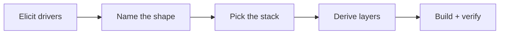

# Hedgehog Authored Core ⭐

### A Real Architecture for the Project That Doesn't Fit a Template

Not every project is an app or a landing page. Sometimes the shape
genuinely doesn't exist yet — and most AI tools respond by picking
whatever stack is easiest to generate, then improvising the rest as
they go.

This core does the opposite: it designs the system properly first, then
builds it one verified layer at a time.



## What you get

- **A real architecture pass** before any code — drivers elicited, a
  system shape named, a stack chosen for this project, not a default.
- **The same discipline as every other core** — layers, scope, and
  verification, generated live instead of pre-built.
- **Nothing improvised mid-build** — the sequence is fixed before the
  first layer starts.

## Built for the project with no template

Reach for this core when the description names a real artifact — but
not one either shipped core's shape fits. If the work is landing on a
codebase that already exists, that's a different core: see
[Hedgehog Adopted](https://github.com/skyf0xx/hedgehog-core-adopted).

## Easy to install and use

Ask your agent:
*"Install Hedgehog and build me [your project]"*

<details>
<summary>For your agent</summary>

```
npx @skyf0xx/hedgehog init
```

Hedgehog's planner selects this core automatically when a project fits
no shipped core's shape. There's no install flag for it directly — it's
designed per project during planning.

Technical details: [ARCHITECTURE.md](ARCHITECTURE.md)
