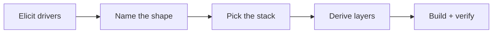

# Hedgehog Authored Core ⭐

### An Architecture Pass for the Project That Doesn't Fit a Template

Not every project is an app or a landing page. Sometimes the shape
doesn't exist yet, and most AI tools respond by picking whatever stack
is easiest to generate, then improvising the rest as they go.

This core designs the system first, then builds it one verified layer
at a time.



## What you get

- **An architecture pass before any code**: drivers elicited, a system
  shape named, a stack chosen for this project instead of a default.
- **The same discipline as every other core**: layers, scope, and
  verification, generated live instead of pre-built.
- **A fixed build sequence**: the layer order locks in before the
  first layer starts, so nothing gets improvised mid-build.

## Built for the project with no template

Reach for this core when the description names a concrete artifact that
doesn't match either shipped core's shape. If the work is landing on an
existing codebase, that's a different core: see
[Hedgehog Adopted](https://github.com/skyf0xx/hedgehog-core-adopted).

## Easy to install and use

Ask your agent:
*"Install Hedgehog and build me [your project]"*

<details>
<summary>For your agent</summary>

```
npx @skyf0xx/hedgehog init
```

Technical details: [ARCHITECTURE.md](ARCHITECTURE.md)
